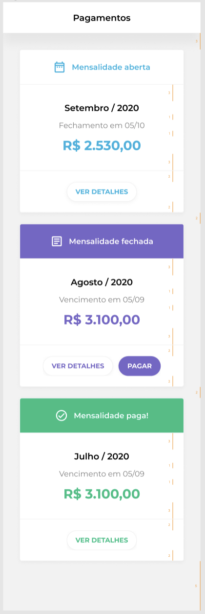
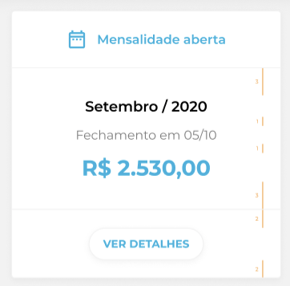
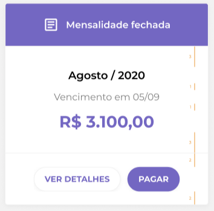
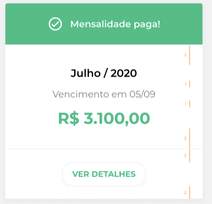
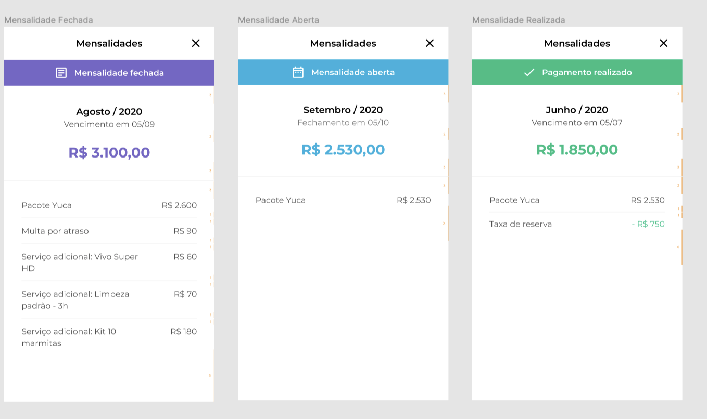
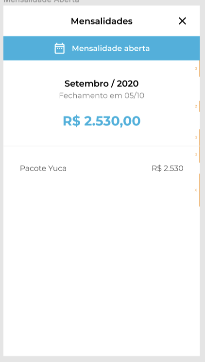
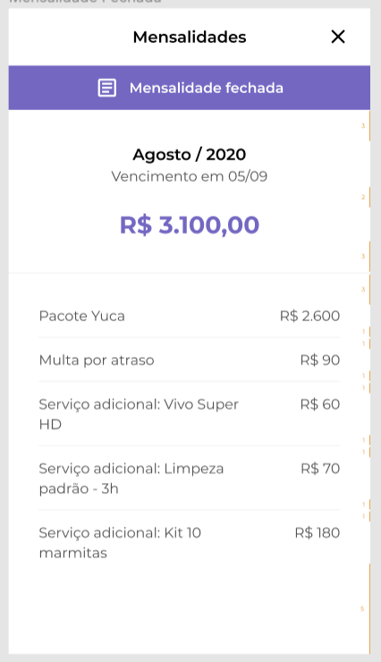
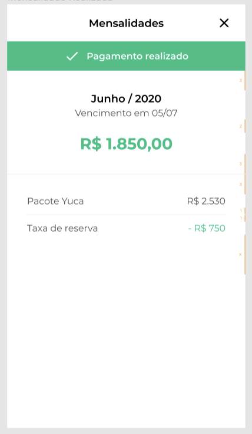

# Desafio Mobile

Linguagem: Flutter

Neste desafio vamos avaliar:

    - Como você desenvolve
    - Como você resolve problemas
    - Boas práticas de desenvolvimento
    - Arquitetura escolhida
    - Habilidade de seguir um layout

Serão considerados bônus:

    - Teste unitário.
    - Teste de UI.

O objetivo desse desafio é criar um aplicativo de pagamentos.

A api e o link para o layout estão disponíveis abaixo.

### 1 - Tela inicial
Exemplo de retorno da api:

```
[
  {
    "status": "open",
    "value": 3100,
    "dueDate": "01/09/2020",
    "effectiveDate": "01/08/2020",
    "details": [
      {
        "descripton": "Pacote Yuca",
        "value": 2600
      },
      {
        "descripton": "Multa por Atraso",
        "value": -90
      },
      {
        "descripton": "Serviço adicional kit 30 marmitas",
        "value": 410
      }
    ]
  }
] 
```

Interface:



Na tela inicial deverá ser consultado uma api com todos os pagamentos e exibi-los em uma listagem em cards.

Requisitos:

- Deverá ser exibido a listagem de pagamentos retornada pela api.

- Enquanto aguarda o retorno do api deverá exibir um loading a sua escolha.

- Dependendo do status do pagamento o formato do card muda.

Caso o status seja "open" o layout do card deverá ser assim:



Caso o status seja "closed" o layout do card deverá ser assim:



Caso o status seja "paid" o layout do card deverá ser assim:



- As datas deverão ser formatadas para o formato igual do layout.

- Quando clicado em ver detalhes deverá navegar para a próxima interface de detalhes de pagamentos

### 2 - Detalhes de pagamentos

Interface:


Nesta interface será exibido os detalhes do pagamento selecionado e a listagem de lançamentos.

Requisitos:

- Dependendo do status do pagamento selecionado o header do card muda.

Caso o status seja "open" o header do card deverá ser assim:



Caso o status seja "closed" o header do card deverá ser assim:



Caso o status seja "paid" o header do card deverá ser assim:



- As datas deverão ser formatadas para o formato igual do layout.

## Links para possibilitar o desafio
A api para realizar a consulta é essa: https://private-42e99d-yuca1.apiary-mock.com/payments

Link do layout a ser seguido com todas as especificações: https://www.figma.com/file/1oXD7jMfBpgPEiVXDW9eV9/Teste-Tech---Dev.-Mobile?node-id=0%3A1

## Conclusão

Crie um Fork desse repositório e envie um pull request.

Caso seu projeto possua alguma pré condição para ser executado, crie um arquivo README.md com um passo a passo para que seja possível executá-lo.

Lembre-se que iremos executar em diferentes devices e no Android e IOS.

Qualquer dúvida pode entrar em contato com a gente =)
